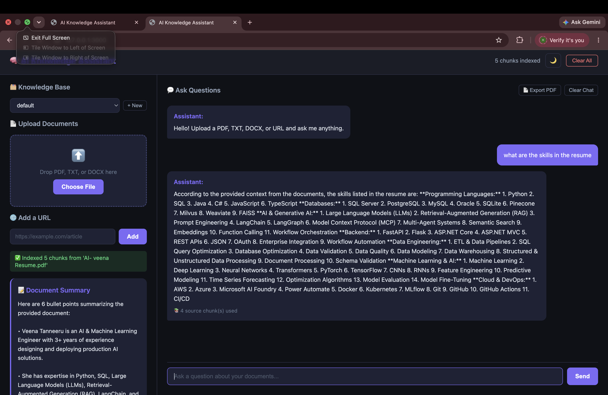

# 🧠 AI Knowledge Assistant

> Upload any PDF, TXT, DOCX, or URL and have a conversation with it using RAG — completely free, runs locally!

## ✨ Features

- 📄 Multi-format support — PDF, TXT, DOCX, and URLs
- 🔍 Semantic search — finds relevant context using ChromaDB
- 💬 Multi-turn chat — remembers conversation history
- 📝 Auto-summary — instantly summarizes uploaded documents
- 📄 Export chat as PDF — download your conversation
- 🗂️ Multiple knowledge bases — organize documents by topic
- 🌙 Dark/Light mode toggle
- 💾 Persistent chat history saved across sessions
- 🆓 100% free — uses Llama 3.2 via Ollama, no API costs

## 🏗️ How It Works

PDF/TXT/DOCX/URL → Text Extraction → Chunking → Embeddings → ChromaDB → Question → Similarity Search → Llama 3.2 → Answer

## 🛠️ Tech Stack

- Backend: FastAPI + Python
- Embeddings: nomic-embed-text via Ollama
- Vector Store: ChromaDB
- LLM: Llama 3.2 via Ollama
- Frontend: Vanilla JS + CSS

## 🚀 Quick Start

Install Ollama from https://ollama.ai

Then run:

git clone https://github.com/veenatanneeru/ai-knowledge-assistant
cd ai-knowledge-assistant
python3 -m venv venv
source venv/bin/activate
pip install -r requirements.txt
ollama pull llama3.2
ollama pull nomic-embed-text

Terminal 1:
cd backend
uvicorn app.main:app --reload --port 8000

Terminal 2:
cd frontend
python3 -m http.server 3000

Open http://127.0.0.1:3000 in Chrome

## 👩‍💻 Author

Veena Tanneeru — AI and ML Engineer
GitHub: https://github.com/veenatanneeru